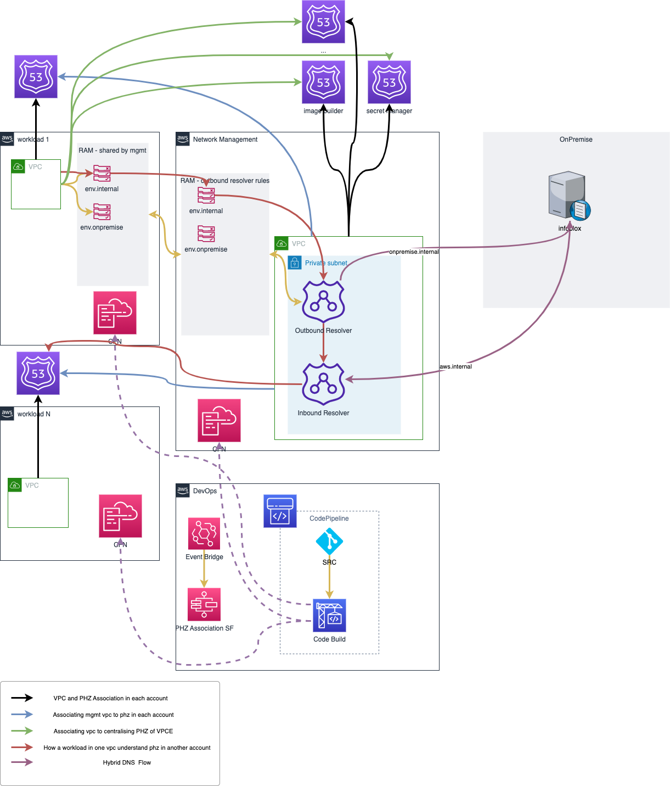

# Centralised Route 53

This repository shows how to architect 
* how different accounts in the same enterprise understand different private host zones
* centralised vpc endpoints across enterprise for cost saving
* hybrid dns solution between onpreimise and aws

## Solution Overview


## Prerequisites

* Existing VPC and subnet
* vpc id stored in ssm parameter /CNS/resources/vpc_id
* phz id stored in ssm parameter /CNS/resources/r53/private_zone_id

## Deploy Local

### Deploy resolvers and RAM in network management
* Choose static private IPs for inbound/outbound Resolver which can be useful when setup on premise dns forwarding

### Deploy Centralised VPC endpoints in network management

### PHZ association in network management
* In spoke accounts, authorize the association of the VPC with the private hosted zone
* In network managemant account, associate the VPC with the hosted zone
* In spoke accounts, delete the authorization

### Associating Centralised PHZ  in spoke accounts
* In network management account, autorize the association of the spoke vpc with the centrailised private hosted zone
* In spoke accounts, associate the vpc with the hosted zone
* In network management account, delete the autorization

### Associating R53 outbound resolver rules in spoke accounts

```bash
aws sts get-caller-identity
sam build && sam deploy --guided
```

## Reference

* [Associating an Amazon VPC and a private hosted zone that you created with different AWS accounts
](https://docs.aws.amazon.com/Route53/latest/DeveloperGuide/hosted-zone-private-associate-vpcs-different-accounts.html)
* [Resolving DNS queries between VPCs and your network]
(https://docs.aws.amazon.com/Route53/latest/DeveloperGuide/resolver.html)
* [cross accounts r53](https://noise.getoto.net/2021/01/20/using-route-53-private-hosted-zones-for-cross-account-multi-region-architectures/)
* [Centralised hybrid dns](https://aws.amazon.com/blogs/architecture/using-route-53-private-hosted-zones-for-cross-account-multi-region-architectures/)